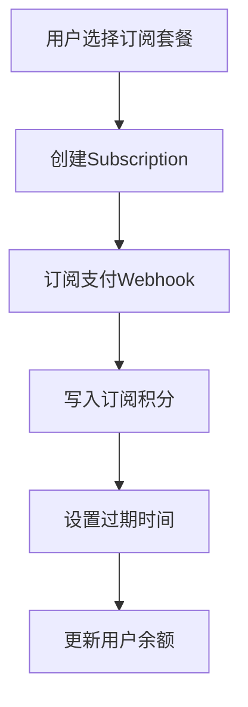
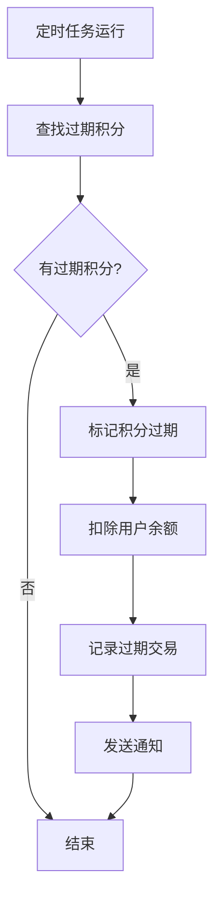

# 数据库重建和订阅积分系统使用指南

## 📋 概述

本指南将帮助您完全重建 AIFaceSwap 项目的数据库，并配置纯订阅积分系统。新系统包含：

- **月订阅**：16.9美金（120积分）
- **年订阅**：118.8美金（1800积分）
- **积分过期机制**：订阅积分到期自动过期
- **智能消费策略**：优先使用即将过期的订阅积分

## 🚀 快速开始

### 第一步：备份现有数据（重要！）

在执行重建之前，请务必备份现有数据：

```bash
# 导出现有数据
pg_dump your_database_url > backup_$(date +%Y%m%d_%H%M%S).sql

# 或者使用 Supabase CLI
supabase db dump --file backup.sql
```

### 第二步：执行数据库重建

⚠️ **警告：此操作将删除所有现有表和数据！**

```sql
-- 在 Supabase SQL Editor 或 psql 中执行
\i src/db/sql/rebuild-database.sql
```

### 第三步：创建支付和积分函数

```sql
-- 在 Supabase SQL Editor 或 psql 中执行
\i src/db/sql/payment-functions.sql
```

### 第四步：测试系统功能

```sql
-- 运行测试脚本验证系统
\i src/db/sql/test-payment-system.sql
```

## 📊 数据库结构说明

### 核心表结构

1. **用户相关表**
   - `user` - 用户基础信息
   - `user_settings` - 用户设置
   - `user_credit_balance` - 用户积分余额

2. **积分系统表**
   - `credit_package` - 积分套餐（仅订阅）
   - `credit_transaction` - 积分交易记录
   - `subscription_credits` - 订阅积分跟踪（每个订阅期的积分和过期时间）
   - `credit_consumption_config` - 积分消费配置

3. **支付相关表**
   - `stripe_customer` - Stripe 客户信息
   - `stripe_subscription` - Stripe 订阅信息

4. **业务功能表**
   - `face_swap_history` - 人脸交换历史
   - `uploads` - 文件上传记录
   - `pending_bonus_credits` - 待处理积分

### 积分套餐配置

系统预置了以下订阅套餐：

```sql
-- 订阅套餐
月订阅套餐: 120积分 = $16.90/月（30天后过期）
年订阅套餐: 1800积分 = $118.80/年（365天后过期）
```

### 关键函数说明

#### 支付处理函数

1. **`handle_subscription_payment_success`**
   - 处理订阅支付成功事件
   - 创建有期限的订阅积分记录
   - 自动过期旧的订阅积分

```sql
-- 使用示例（月订阅）
SELECT handle_subscription_payment_success(
  'sub_monthly_123',
  'user_id',
  120,
  'monthly',
  NOW(),
  NOW() + INTERVAL '30 days'
);

-- 使用示例（年订阅）
SELECT handle_subscription_payment_success(
  'sub_yearly_456',
  'user_id',
  1800,
  'yearly',
  NOW(),
  NOW() + INTERVAL '365 days'
);
```

2. **`consume_credits`**
   - 智能消费积分
   - 优先使用即将过期的订阅积分

```sql
-- 使用示例
SELECT consume_credits('user_id', 1, '人脸交换操作');
```

3. **`expire_subscription_credits`**
   - 处理过期的订阅积分
   - 自动扣除过期积分并记录交易

```sql
-- 使用示例
SELECT expire_subscription_credits();
```

## 🔧 支付系统配置

### Webhook 配置

1. **Stripe Webhook 端点**
   - 订阅支付: `https://your-domain.com/api/webhooks/stripe-subscription`
   - 事件类型: `invoice.payment_succeeded` - 订阅支付成功

2. **支付流程图**



3. **订阅积分过期流程**



### 环境变量配置

确保在您的 `.env` 文件中配置以下变量：

```bash
# Supabase 配置
NEXT_PUBLIC_SUPABASE_URL=your_supabase_url
NEXT_PUBLIC_SUPABASE_ANON_KEY=your_anon_key
SUPABASE_SERVICE_ROLE_KEY=your_service_role_key

# Stripe 配置
STRIPE_SECRET_KEY=your_stripe_secret_key
STRIPE_WEBHOOK_SECRET=your_webhook_secret

# 产品配置
STRIPE_MONTHLY_PRICE_ID=price_monthly_120_credits
STRIPE_YEARLY_PRICE_ID=price_yearly_1800_credits
```

## 🔍 问题排查

### 常见问题及解决方案

#### 1. 订阅支付成功但积分未增加

**可能原因:**
- 订阅 Webhook 未正确配置
- 订阅期间已存在积分记录
- 用户ID 匹配失败

**解决方案:**
```sql
-- 检查订阅积分记录
SELECT * FROM subscription_credits 
WHERE user_id = 'user_id' 
ORDER BY created_at DESC;

-- 手动处理订阅支付
SELECT handle_subscription_payment_success(
  'subscription_id',
  'user_id',
  120, -- 或 1800
  'monthly', -- 或 'yearly'
  period_start,
  period_end
);
```

#### 2. 积分未按期过期

**解决方案:**
```sql
-- 手动执行过期处理
SELECT expire_subscription_credits();

-- 检查过期积分状态
SELECT 
  user_id,
  subscription_id,
  remaining_credits,
  end_date,
  status,
  CASE WHEN end_date < NOW() THEN 'SHOULD_EXPIRE' ELSE 'ACTIVE' END as should_be
FROM subscription_credits 
WHERE status = 'active';
```

#### 3. 积分余额不一致

**解决方案:**
```sql
-- 验证积分余额一致性
WITH subscription_totals AS (
  SELECT 
    user_id,
    SUM(remaining_credits) as total_subscription_remaining
  FROM subscription_credits 
  WHERE status = 'active'
  GROUP BY user_id
)
SELECT 
  ucb.user_id,
  ucb.balance,
  COALESCE(st.total_subscription_remaining, 0) as calculated_balance,
  CASE 
    WHEN ucb.balance = COALESCE(st.total_subscription_remaining, 0)
    THEN 'CONSISTENT'
    ELSE 'INCONSISTENT'
  END as status
FROM user_credit_balance ucb
LEFT JOIN subscription_totals st ON ucb.user_id = st.user_id;
```

### 监控和日志

#### 1. 订阅状态监控

```sql
-- 创建订阅积分监控视图
CREATE VIEW subscription_credits_monitor AS
SELECT 
  sc.user_id,
  sc.subscription_id,
  sc.credits as total_credits,
  sc.remaining_credits,
  sc.start_date,
  sc.end_date,
  sc.status,
  CASE 
    WHEN sc.end_date < NOW() AND sc.status = 'active' THEN 'NEEDS_EXPIRATION'
    WHEN sc.end_date > NOW() AND sc.status = 'active' THEN 'ACTIVE'
    WHEN sc.status = 'expired' THEN 'EXPIRED'
    ELSE 'UNKNOWN'
  END as computed_status,
  ucb.balance as user_balance
FROM subscription_credits sc
LEFT JOIN user_credit_balance ucb ON sc.user_id = ucb.user_id
ORDER BY sc.end_date ASC;

-- 查看监控信息
SELECT * FROM subscription_credits_monitor;
```

#### 2. 系统健康检查

```sql
-- 运行完整系统健康检查
SELECT 
  'Total Users' as metric,
  COUNT(*) as value
FROM "user"
UNION ALL
SELECT 
  'Active Credit Balances' as metric,
  COUNT(*) as value
FROM user_credit_balance
UNION ALL
SELECT 
  'Active Subscription Credits' as metric,
  COUNT(*) as value
FROM subscription_credits WHERE status = 'active'
UNION ALL
SELECT 
  'Expired Subscription Credits' as metric,
  COUNT(*) as value
FROM subscription_credits WHERE status = 'expired'
UNION ALL
SELECT 
  'Today Transactions' as metric,
  COUNT(*) as value
FROM credit_transaction WHERE created_at >= CURRENT_DATE;
```

## 🛠️ 维护操作

### 定期维护任务

#### 1. 定时过期积分处理

建议设置每小时运行一次的定时任务：

```sql
-- 创建定时过期处理
SELECT scheduled_expire_credits();
```

或者在应用程序中设置 cron 任务：

```javascript
// 使用 node-cron
const cron = require('node-cron');

// 每小时检查过期积分
cron.schedule('0 * * * *', async () => {
  try {
    const { data, error } = await supabase.rpc('scheduled_expire_credits');
    if (error) throw error;
    console.log('Expired credits processed:', data);
  } catch (error) {
    console.error('Error processing expired credits:', error);
  }
});
```

#### 2. 清理过期数据

```sql
-- 清理超过30天的过期订阅积分记录
DELETE FROM subscription_credits 
WHERE status = 'expired' 
  AND updated_at < NOW() - INTERVAL '30 days';
```

#### 3. 数据完整性检查

```sql
-- 运行完整性检查
DO $$
DECLARE
  orphaned_count INTEGER;
  negative_balance_count INTEGER;
BEGIN
  -- 检查孤立的交易记录
  SELECT COUNT(*) INTO orphaned_count
  FROM credit_transaction ct
  LEFT JOIN user_credit_balance ucb ON ct.user_id = ucb.user_id
  WHERE ucb.user_id IS NULL;
  
  -- 检查负余额
  SELECT COUNT(*) INTO negative_balance_count
  FROM user_credit_balance
  WHERE balance < 0;
  
  -- 报告结果
  IF orphaned_count > 0 THEN
    RAISE WARNING 'Found % orphaned transactions', orphaned_count;
  END IF;
  
  IF negative_balance_count > 0 THEN
    RAISE WARNING 'Found % negative balances', negative_balance_count;
  END IF;
  
  IF orphaned_count = 0 AND negative_balance_count = 0 THEN
    RAISE NOTICE 'Data integrity check passed ✅';
  END IF;
END $$;
```

### 性能优化

#### 1. 索引维护

```sql
-- 检查索引使用情况
SELECT 
  schemaname,
  tablename,
  indexname,
  idx_scan as times_used,
  idx_tup_read as tuples_read,
  idx_tup_fetch as tuples_fetched
FROM pg_stat_user_indexes 
WHERE schemaname = 'public'
  AND tablename IN ('subscription_credits', 'credit_transaction', 'user_credit_balance')
ORDER BY idx_scan DESC;
```

#### 2. 查询性能分析

```sql
-- 分析订阅积分查询性能
EXPLAIN ANALYZE 
SELECT sc.*, ucb.balance
FROM subscription_credits sc
JOIN user_credit_balance ucb ON sc.user_id = ucb.user_id
WHERE sc.user_id = 'specific_user_id'
  AND sc.status = 'active'
ORDER BY sc.end_date ASC;
```

## 🔐 安全考虑

### RLS 策略

系统已配置完整的行级安全策略：

1. **用户只能访问自己的数据**
2. **服务角色可以管理所有数据**
3. **订阅积分数据受到额外保护**

### 函数安全

所有关键函数都使用 `SECURITY DEFINER` 确保：

1. **权限提升执行**
2. **绕过 RLS 限制**
3. **事务安全性**
4. **防止SQL注入**

## 📝 API 使用示例

### 在应用代码中使用

```typescript
// 获取用户详细积分信息
const { data } = await supabase.rpc('get_user_credits', {
  p_user_id: userId
});

// 消费积分（优先使用即将过期的积分）
const { data } = await supabase.rpc('consume_credits', {
  p_user_id: userId,
  p_amount: 1,
  p_description: 'Face swap operation'
});

// 处理订阅支付成功
const { data } = await supabase.rpc('handle_subscription_payment_success', {
  p_subscription_id: subscriptionId,
  p_user_id: userId,
  p_credits: 120, // 月订阅
  p_subscription_period: 'monthly',
  p_current_period_start: periodStart,
  p_current_period_end: periodEnd
});

// 检查并处理过期积分
const { data } = await supabase.rpc('check_and_expire_credits', {
  p_user_id: userId // 可选，为空则处理所有用户
});
```

### Webhook 处理示例

```typescript
// 处理订阅支付 webhook
app.post('/api/webhooks/stripe-subscription', async (req, res) => {
  const sig = req.headers['stripe-signature'];
  let event;

  try {
    event = stripe.webhooks.constructEvent(req.body, sig, process.env.STRIPE_WEBHOOK_SECRET);
  } catch (err) {
    return res.status(400).send(`Webhook signature verification failed.`);
  }

  if (event.type === 'invoice.payment_succeeded') {
    const invoice = event.data.object;
    const subscription = await stripe.subscriptions.retrieve(invoice.subscription);
    
    // 获取用户ID
    const { data: userData } = await supabase.rpc('get_user_by_stripe_customer', {
      p_customer_id: subscription.customer
    });

    if (userData) {
      // 确定积分数量
      const credits = subscription.items.data[0].price.id === process.env.STRIPE_MONTHLY_PRICE_ID ? 120 : 1800;
      const period = subscription.items.data[0].price.id === process.env.STRIPE_MONTHLY_PRICE_ID ? 'monthly' : 'yearly';

      // 处理订阅支付
      const { data, error } = await supabase.rpc('handle_subscription_payment_success', {
        p_subscription_id: subscription.id,
        p_user_id: userData,
        p_credits: credits,
        p_subscription_period: period,
        p_current_period_start: new Date(subscription.current_period_start * 1000).toISOString(),
        p_current_period_end: new Date(subscription.current_period_end * 1000).toISOString()
      });

      if (error) {
        console.error('Error processing subscription payment:', error);
        return res.status(500).json({ error: 'Internal server error' });
      }
    }
  }

  res.json({ received: true });
});
```

## 📞 支持

如果您在使用过程中遇到问题：

1. **检查日志** - 查看 Supabase 日志和应用日志
2. **运行测试** - 执行 `test-payment-system.sql` 验证功能
3. **监控检查** - 使用监控视图检查系统状态
4. **数据备份** - 确保定期备份重要数据
5. **联系支持** - 提供具体的错误信息和复现步骤

---

**重要提醒:**
- 在生产环境中执行重建前务必备份数据
- 测试所有功能后再上线
- 设置定时任务处理积分过期
- 定期监控订阅和积分系统的运行状况
- 保持环境变量的安全性
- 确保 Webhook 端点的安全性 